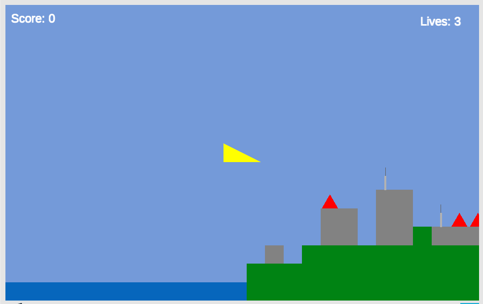
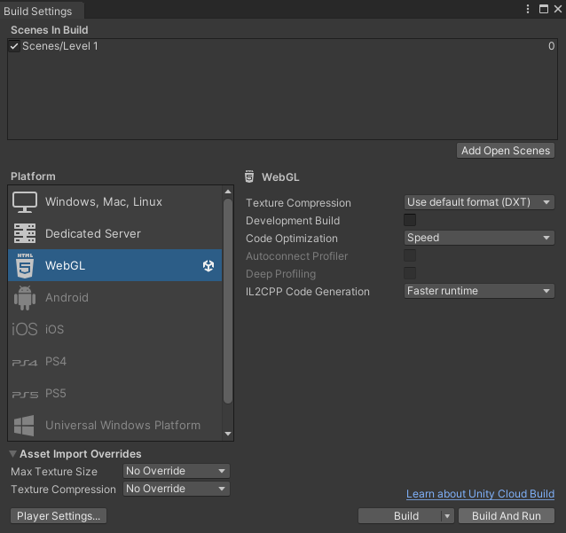

# COMP2160 Prac Week 6 - QA

## Topics covered:
* QA
* Test scenes
* Platform Compatibility

> ## Discussion (15 min)
> Your game is undergoing large-scale playtesting and you have been tasked to implement game analytics. Your CEO is enthusiastic about an online service that implements eye-tracking biometrics using the player’s webcam on their home PC. Your design team agree that eye-tracking data would be very helpful to understand which parts of the interface the player is paying attention to when making their in-game decisions. What ethical concerns would you have about this plan? How might you address them?

## Today's Task
In this prac you will be conducting Quality Assurance testing on an arcade game:
https://wordsonplay.itch.io/comp2160-prac-6

 
Use the arrow keys to move the ship. Press X to fire the forwards gun and Z to drop a bomb. Your goal is to destroy the reactor at the end of the level.
The Unity project implements the entire game for you, but it contains several bugs. It is your job to conduct QA testing. 

### Documentation
You will find four files in the Documentation folder, placed at the top level of the repo:
* Design doc – A design document for the game describing all the required mechanics
* QA plan – A spreadsheet template for a QA plan
* Bug Report – A spreadsheet template for a bug report plan
* Compatibility Matrix - A spreadsheet template for logging compatibility notes and issues

## Step 1 – QA planning (20 min)
Your job is to check that the game implementation matches the requirements specified in the design document. 

The QA plan already contains descriptions for a number of tests. Carry out these tests and make sure the game satisfies the requirements.

Work through the design document and add new entries to test each requirement. Each test should include:
* The requirement you are testing.
* A list of instructions for the QA tester to perform.
* A description of the expected result.

Brainstorm unexpected scenarios that might cause bugs. Have a chat with the person next to you about different scenarios. Don't be afraid to share test cases! You'll still need to test them individually.

You should come up with at least 5 test cases. 

## Step 2 - Test Scenes & Logs (20 min)
Test scenes are an important part of development. The project already contains one test scene, entitled "Empty Scene". Go through your list of tests and identify which ones require a new test scene.

When creating test scenes, consider:

* What are the entitites related to the feature you are testing? These need to go into your scene.
* Do these entitites have any dependencies? If so, they will also need to be added to the scene (this may expose problems with the project's architecture, but that's a problem for another day).
* What `Debug.Log` messages will help with your testing? Do you need to print out particular values, or messages when certain events trigger? Add these to the relevant code.

You should have at least three additional test scenes.

### Checkpoint! Save, commit and push your work now.

## Step 3 – Bug Reports (20 min)
The second page of the spreadsheet is for recording bugs. One bug has already been provided. You should be able to locate at least 4 additional bugs in the game (there are plenty).

Fill out the bug report spreadsheet for each bug, including:
* The severity of the bug:
    * Blocker (0) – Blocks testing and there is no workaround
    * Crash Bug (1) – Crashes the game but there may be a workaround 
    * Critical Bug (2) – Major functionality problem 
    * Minor Bug (3) – Error that is noticeable but not critical 
    * Feature Request (4) – Desirable change but not currently a defined feature

* The component of the game affected
* A short summary of the bug
* The ID of the test that generated the bug
* The scene in which the bug can be demonstrated
* How to reproduce the bug (if possible)
* What you expect the game to do
* What actually happens
* A filename for a screenshot of the bug or relevant debug message(s)

### Checkpoint! Save, commit and push your work now.

## Step 4 - Compatibility Testing (20 min)
Compatibility Testing is an important step in making sure your game works across different devices. This isn't just about building for different consoles, but also considering minimum computer specs and resolutions.

Inside the Documentation folder, you'll find a Compatibility Matrix spreadsheet. Your task is to test the game across different platforms. For the purposes of this prac, we'll consider a "platform" to be a specific combination of:

* The build platform (WebGL, Windows, etc.)
* The hardware specs of the device you are testing on
* The operating system you are testing on (Windows 11, OSX, etc.)
* The dimensions of the screen you are testing on
* For web builds, the browser you are testing on (Firefox, Safari, etc.)
* The interface used to play the game (keyboard, gamepad, etc.)

You should test compatibility across at least four different platforms, recording each of the above specifications in the spreadsheet. For each test, also record:

* The build version (to keep track of changes)
* Any notes on the UI compatibility (are things displaying properly?)
* Any notes on performance compatibility (is everything working as expected?)
* Any additional compatibility notes not covered by the other two sections

You may use your own device to do this, and include the sample solution provided as one test build.

You can find the specifications of the computer you are on by clicking:

Windows: Start > About Your PC 
Mac: Apple Menu > System Settings > General > About > System Report 
Linux: If you are running a Linux operating system you do not need my help doing this.

### Building the game
To perform these tests, you'll need to make builds of the game. To do this, press File > Build Settings and select your Build Platform (either Windows, Mac, Linux or WebGL). You may need to Switch Platforms, which can take a short amount of time.

NOTE: If you are making a web build, you probably want to be able to test this without uploading it online. To do so, use the "Build and Run" option.

### Controller settings
Add gamepad or mouse support by editing the Input Actions Asset, and test these different input settings.

### Changing settings
If you notice any problems with compatibility, you can make changes to quality and resolution by selecting "Player Settings..." from the Build Settings panel.

### Prac Complete! Save, commit and push your work now.

## To receive full marks for today, show your tutor:
* Your QA plan, with at least 5 test cases you have created and three test scenes.
* Your bug report, with at least 4 bugs you have located, completely catalogued and with screenshots where appropriate.
* Your filled out Compatibility Matrix table, with at least four different compatibility tests.
